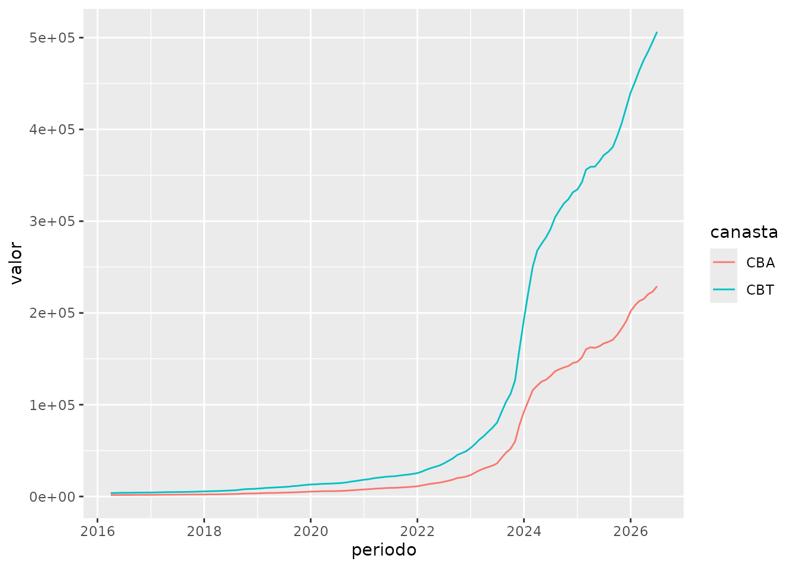

# Ejemplo de uso del paquete \`eph\`

El paquete `eph` tiene como objetivo facilitar el trabajo con los
microdatos de la Encuesta Permanente de Hogares. Este tutorial busca
ejemplificar un pipeline de trabajo más o menos típico para mostrar el
uso de las funciones del paquete.

## Instalación

Para instalar la versión estable del paquete usar:

    install.packages('eph')

Para la versión en desarrollo:

    # install.packages('devtools') si no tiene instalado devtools

    devtools::install_github("holatam/eph")

## Ejemplo de flujo de trabajo

### Descarga de datos: `get_microdata()`

``` r

library(eph)
library(dplyr)
library(tidyr)
library(purrr)
library(ggplot2)
```

Obtengamos la base de microdatos de individuos para el tercer trimestre
de 2018:

``` r

ind_3_18 <- get_microdata(
  year = 2018,
  period = 3,
  type = "individual"
)
```

Puede verse que la función requiere tres argumentos básicos que definen
cuál es la encuesta que se desea descargar.

### Etiquetado: `organize_labels()`

Es posible etiquetar de forma automática el dataset descargado
previamente usando
[`get_microdata()`](https://docs.ropensci.org/eph/reference/get_microdata.md)
llamando a la función
[`organize_labels()`](https://docs.ropensci.org/eph/reference/organize_labels.md)
(el resultado de esta operación no es renombrar los valores o nombres de
las columnas, sino agregar etiquetas con esta información):

``` r

ind_3_18 <- organize_labels(
  df = ind_3_18,
  type = "individual"
)
```

Descarguemos y etiquetemos la base de hogares del 3 trimestre de 2018.
Podemos hacer uso de los `%>%` pipes de `magrittr`:

``` r

hog_3_18 <- get_microdata(
  year = 2018,
  period = 3,
  type = "hogar"
) %>%
  organize_labels(.,
    type = "hogar"
  )
```

### Tabulados ponderados: `calculate_tabulates()`

Una de las operaciones más usuales al trabajar con la EPH son los
tabulados uni y bivariados. Para ello, el paquete cuenta con la función
[`calculate_tabulates()`](https://docs.ropensci.org/eph/reference/calculate_tabulates.md),
la cual brinda la posibilidad de obtener tanto resultados en valores
absolutos como porcentuales, como así también contar con la posibilidad
de extrapolar los datos según el factor de ponderación correspondiente:

``` r

calculate_tabulates(
  base = ind_3_18,
  x = "NIVEL_ED",
  y = "CH04",
  weights = "PONDERA",
  add.totals = "row",
  add.percentage = "col"
)
#> # A tibble: 8 × 3
#>   `NIVEL_ED/CH04`                                  Varon Mujer
#>   <chr>                                            <dbl> <dbl>
#> 1 Primaria incompleta (incluye educacion especial)  15.1  13.7
#> 2 Primaria completa                                 12.7  13.2
#> 3 Secundaria incompleta                             22.9  18.5
#> 4 Secundaria completa                               19.1  19  
#> 5 Superior universitaria incompleta                 10.4  12.4
#> 6 Superior universitaria completa                   10.3  14.7
#> 7 Sin instruccion                                    9.6   8.6
#> 8 Total                                            100   100
```

Así, si quisiéramos la misma tabla sin ponderar:

``` r

calculate_tabulates(
  base = ind_3_18,
  x = "NIVEL_ED",
  y = "CH04",
  add.totals = "row",
  add.percentage = "col"
)
#> # A tibble: 8 × 3
#>   `NIVEL_ED/CH04`                                  Varon Mujer
#>   <chr>                                            <dbl> <dbl>
#> 1 Primaria incompleta (incluye educacion especial)  15.3  14  
#> 2 Primaria completa                                 12.7  12.9
#> 3 Secundaria incompleta                             22.9  18.8
#> 4 Secundaria completa                               19.4  19.1
#> 5 Superior universitaria incompleta                 10.3  12.2
#> 6 Superior universitaria completa                    9.5  14.1
#> 7 Sin instruccion                                   10     8.9
#> 8 Total                                            100   100
```

### Armando pools de datos (“análisis de panel”): `organize_panels()`

Otra potencialidad del trabajo con microdatos de la EPH es la capacidad
de generar un pool de observaciones de panel. Este procedimiento consta
en identificar a una misma persona u hogar encuestado en distintos
trimestres, y permite realizar estudios sobre la evolución de sus
características con el correr del tiempo. Esto puede generarse, para las
bases individuales en `eph` con la función
[`organize_panels()`](https://docs.ropensci.org/eph/reference/organize_panels.md).
Para ello es necesario contar previamente con las múltiples bases de
datos que se deseen poolear, y armar un objeto de tipo lista que las
contenga.

``` r

### Armo vector con el nombre de las variables de interés incluyendo
# -variables necesarias para hacer el panel
# -variables que nos interesan en nuestro análisis
variables <- c(
  "CODUSU", "NRO_HOGAR", "COMPONENTE", "ANO4",
  "TRIMESTRE", "CH04", "CH06", 
  "ESTADO", "PONDERA"
) 

### Descargo la base individual para el 2018_t1
base_2018t1 <- get_microdata(
  year = 2018, period = 1, type = "individual",
  vars = variables
)

### Descargo la base individual para el 2018_t2
base_2018t2 <- get_microdata(
  year = 2018, period = 2, type = "individual",
  vars = variables
)

### Armo el panel
pool <- organize_panels(
  bases = list(base_2018t1, base_2018t2),
  variables = c("ESTADO", "PONDERA"),
  window = "trimestral"
)
```

``` r

pool
#> # A tibble: 25,411 × 17
#>    CODUSU        NRO_HOGAR COMPONENTE  ANO4 TRIMESTRE  CH04  CH06 ESTADO PONDERA
#>    <fct>             <int>      <int> <int>     <int> <int> <int>  <int>   <int>
#>  1 TQRMNORUTHMK…         1          1  2018         1     2    67      3    1008
#>  2 TQRMNORUTHMK…         1          2  2018         1     1    81      1    1008
#>  3 TQRMNORUTHMK…         1          3  2018         1     2    22      2    1008
#>  4 TQRMNOVQVHMO…         1          1  2018         1     1    62      1     886
#>  5 TQRMNORPYHMM…         1          1  2018         1     1    83      3     594
#>  6 TQRMNORPYHMM…         1          2  2018         1     2    79      3     594
#>  7 TQRMNOTSYHKM…         1          1  2018         1     2    79      3     700
#>  8 TQRMNOQTTHKM…         1          1  2018         1     1    38      1     700
#>  9 TQRMNOQTTHKM…         1          2  2018         1     2    33      1     700
#> 10 TQRMNOQRVHMM…         1          1  2018         1     1    64      1     546
#> # ℹ 25,401 more rows
#> # ℹ 8 more variables: Periodo <yearqtr>, ANO4_t1 <int>, TRIMESTRE_t1 <int>,
#> #   CH04_t1 <int>, CH06_t1 <int>, ESTADO_t1 <int>, PONDERA_t1 <int>,
#> #   consistencia <lgl>
```

La función nos devuelve un data.frame similar a la base original, en el
cual cada fila es un registro individual, que consta de las
observaciones de las variables de interés especificadas, en dos periodos
de tiempo. En el período inicial las mismas conservan su nombre, y en el
siguiente (año o trimestre) aparecen renombradas con el agregado del
string `_t1`.

El trabajo que realiza la función es concatenar todas las bases
espeficadas y hacer un `join`, conservando sólo aquellos individuos
encuestados en los diferentes trimestres. La columna `consistencia`
evalúa si entre ambas observaciones un mismo individuo figura con
distinto sexo o con una diferencia absoluta de 2 años de edad.

``` r

pool %>%
  organize_labels(.) %>%
  calculate_tabulates(
    x = "ESTADO",
    y = "ESTADO_t1",
    weights = "PONDERA",
    add.percentage = "row"
  )
#> # A tibble: 4 × 5
#>   `ESTADO/ESTADO_t1`   `1`   `2`   `3`   `4`
#>   <chr>              <dbl> <dbl> <dbl> <dbl>
#> 1 Ocupado             88.7   4     7.3   0  
#> 2 Desocupado          36.2  34.7  29     0  
#> 3 Inactivo             7.5   3.5  88.8   0.2
#> 4 Menor de 10 anios.   0     0     3.7  96.3
```

Un indicador frecuente construido con esta información es la *Matriz de
Transición*. Ella refleja como los individuos que ocupaban una
determinada categoría en el período inicial, se distribuyen en cada una
de las categorías en el período siguiente. La misma puede construirse
sencillamente utilizando la función `calculate_tabulates`. En este
ejemplo, la información refleja que durante 2018, un 3.7% de los
ocupados perdió su empleo en el trimestre siguiente.

### Iterando en varias bases

Dado que levantar muchas bases al mismo tiempo puede superar el espacio
disponible en memoria, es posible hacer una selección de variables al
mismo tiempo que se levantan las bases:

``` r

df <- get_microdata(
  year = 2017:2019,
  period = 1:4,
  type = "individual",
  vars = c("ANO4", "TRIMESTRE", "PONDERA", "ESTADO", "CAT_OCUP")
)

df %>%
  sample_n(5)
#> # A tibble: 5 × 5
#>    ANO4 TRIMESTRE PONDERA ESTADO CAT_OCUP
#>   <int>     <int>   <int>  <int>    <int>
#> 1  2018         2      62      3        0
#> 2  2019         2     809      2        2
#> 3  2018         2    1014      3        0
#> 4  2019         1     219      3        0
#> 5  2018         3     103      3        0
```

Con estos datos podemos crear por ejemplo la serie de asalarización

$`SO_{t} = \frac{\sum_{i=1}^n w_{i}TCP_{i}}{\sum_{i=1}^n w_{i}OCUP_{i}}`$

``` r

df <- df %>%
  group_by(ANO4, TRIMESTRE) %>%
  summarise(indicador = sum(PONDERA[CAT_OCUP == 3 & ESTADO == 1], na.rm = T) / sum(PONDERA[ESTADO == 1], na.rm = T))
#> `summarise()` has regrouped the output.
#> ℹ Summaries were computed grouped by ANO4 and TRIMESTRE.
#> ℹ Output is grouped by ANO4.
#> ℹ Use `summarise(.groups = "drop_last")` to silence this message.
#> ℹ Use `summarise(.by = c(ANO4, TRIMESTRE))` for per-operation grouping
#>   (`?dplyr::dplyr_by`) instead.

df
#> # A tibble: 12 × 3
#> # Groups:   ANO4 [3]
#>     ANO4 TRIMESTRE indicador
#>    <int>     <int>     <dbl>
#>  1  2017         1     0.742
#>  2  2017         2     0.751
#>  3  2017         3     0.745
#>  4  2017         4     0.748
#>  5  2018         1     0.752
#>  6  2018         2     0.740
#>  7  2018         3     0.741
#>  8  2018         4     0.745
#>  9  2019         1     0.745
#> 10  2019         2     0.741
#> 11  2019         3     0.726
#> 12  2019         4     0.726
```

### Cálculo de pobreza: `calculate_poverty()`

Un objetivo del paquete `eph`, es lograr automatizar el cálculo de
pobreza e indigencia del INDEC para las bases trimestrales[^1]. El gran
problema es que no existe información publicada fuera de los informes de
prensa en formato pdf sobre los valores de las canastas básicas y
alimentarias.

No obstante, hemos desarrollado dos funciones que, de encontrarse
disponibles dichos datos, podrían calcular de forma automática los
valores de pobreza e indigencia. Mostraremos un ejemplo de juguete con
dos datasets de la CABA y sus respectivos valores de canastas.

Existen dos funciones núcleo:

``` r

lineas <- get_poverty_lines()
lineas
#> # A tibble: 124 × 4
#>    periodo               CBA   ICE   CBT
#>    <dttm>              <dbl> <dbl> <dbl>
#>  1 2016-04-01 00:00:00 1515.  2.42 3664.
#>  2 2016-05-01 00:00:00 1561.  2.45 3831.
#>  3 2016-06-01 00:00:00 1614.  2.44 3943.
#>  4 2016-07-01 00:00:00 1666.  2.42 4034.
#>  5 2016-08-01 00:00:00 1675.  2.41 4042.
#>  6 2016-09-01 00:00:00 1711.  2.39 4090.
#>  7 2016-10-01 00:00:00 1739.  2.41 4192.
#>  8 2016-11-01 00:00:00 1763.  2.41 4248.
#>  9 2016-12-01 00:00:00 1767.  2.41 4258.
#> 10 2017-01-01 00:00:00 1789.  2.41 4312.
#> # ℹ 114 more rows
```

Esta función descarga los valores de las canastas alimentaria, básica
(CBA y CBT) y la inversa del coeficiente de Engels… perdón, Engel (ICE)
de [la serie provista por
INDEC](https://www.indec.gob.ar/indec/web/Nivel4-Tema-4-43-149). Esta es
la serie para GBA, y es la que publica regularmente INDEC.

``` r

lineas %>%
  select(-ICE) %>%
  pivot_longer(cols = c("CBA", "CBT"), names_to = "canasta", values_to = "valor") %>%
  ggplot() +
  geom_line(aes(x = periodo, y = valor, col = canasta))
```



Para el calculo de la Pobreza e Indigencia se utilizan canastas
regionales, que sólo aparecen en los [informes
Técnicos](https://www.indec.gob.ar/uploads/informesdeprensa/eph_pobreza_01_19422F5FC20A.pdf).

A modo de ejemplo, en la librería `eph` se encuentra la base
`canastas_reg_example` con la información necesaria para realizar el
cálculo

``` r

canastas_reg_example
#> # A tibble: 12 × 5
#>    region    periodo   CBA   CBT codigo
#>    <chr>     <chr>   <dbl> <dbl>  <dbl>
#>  1 Cuyo      2016.3  1509. 3872.     42
#>  2 Cuyo      2016.4  1570. 4030.     42
#>  3 GBA       2016.3  1684. 4053.      1
#>  4 GBA       2016.4  1756. 4232.      1
#>  5 Noreste   2016.3  1513. 3414.     41
#>  6 Noreste   2016.4  1568. 3539.     41
#>  7 Noroeste  2016.3  1472. 3292.     40
#>  8 Noroeste  2016.4  1525. 3412.     40
#>  9 Pampeana  2016.3  1676. 4034.     43
#> 10 Pampeana  2016.4  1746. 4209.     43
#> 11 Patagonia 2016.3  1735. 4742.     44
#> 12 Patagonia 2016.4  1813. 4963.     44
```

A su vez, también se encuentra la tabla de `adulto_equivalente` que
permite construir la cantidad de adultos equivalentes a nivel hogar,
para multiplicar al mismo por la canasta regional correspondiente, a fin
de definir la línea a nivel hogar (de acuerdo con la metodología
propuesta por
[INDEC](https://www.indec.gob.ar/ftp/cuadros/sociedad/preguntas_frecuentes_cba_cbt.pdf):
para identificar la unidad consumidora de referencia, o adulto
equivalente, se analizó en qué grupo de edad se ubicaba la mayor
concentración de población activa, y fue la categoría de hombres de 30 a
60 años de edad la que presentaba el mayor peso relativo dentro del
conjunto total de la población de referencia).

``` r

adulto_equivalente %>% head()
#>   CH04 CH06 adequi
#> 1    1   -1   0.35
#> 2    1    1   0.37
#> 3    1    2   0.46
#> 4    1    3   0.51
#> 5    1    4   0.55
#> 6    1    5   0.60
```

La función `calculate_poverty` calcula la pertenencia a situaciones de
pobreza e indigencia a nivel de los individuos siguiendo la metodología
de línea:

``` r

bases <- bind_rows(toybase_individual_2016_03, toybase_individual_2016_04)
base_pobreza <- calculate_poverty(
  base = bases,
  basket = canastas_reg_example,
  print_summary = TRUE
)
#> # A tibble: 2 × 4
#> # Groups:   ANO4 [1]
#>    ANO4 TRIMESTRE Tasa_pobreza Tasa_indigencia
#>   <int>     <int>        <dbl>           <dbl>
#> 1  2016         3       0.0296          0.0136
#> 2  2016         4       0.0324          0.0122
```

``` r

base_pobreza %>%
  select(CODUSU, ITF, region, adequi_hogar, CBA_hogar, CBT_hogar, situacion) %>%
  sample_n(10)
#> # A tibble: 10 × 7
#>    CODUSU                  ITF region adequi_hogar CBA_hogar CBT_hogar situacion
#>    <fct>                 <int> <chr>         <dbl>     <dbl>     <dbl> <chr>    
#>  1 TQRMNOPWYHKKKMCDEIHJ… 21000 Patag…         0.76     1378.     3772. no_pobre 
#>  2 TQRMNOQTUHMOLPCDEGOI… 26000 Noroe…         1.02     1502.     3358. no_pobre 
#>  3 TQRMNOQPRHJLKOCDEOJA…     0 Patag…         0.68     1233.     3375. NA       
#>  4 TQRMNOQUPHKMKQCDEHIB… 19000 Noroe…         1        1525.     3412. no_pobre 
#>  5 TQRMNOSTTHKOKUCDEGOI…  2500 Noroe…         1.02     1556.     3480. pobre    
#>  6 TQRMNOTTVHLOLSCDEIKA…     0 Pampe…         2.52     4224.    10165. NA       
#>  7 TQRMNOQWTHJMKSCDEGJB…     0 Pampe…         1        1676.     4034. NA       
#>  8 TQRMNOPSPHMOKOCDEHJG… 11000 Noroe…         0.68     1001.     2239. no_pobre 
#>  9 TQRMNORRQHLOKNCDEFOC… 10000 Nores…         1.03     1615.     3645. no_pobre 
#> 10 TQRMNOPQQHJMTQCDEIJA…     0 GBA            0.9      1581.     3809. NA
```

[^1]: El calculo oficial se realiza sobre bases semestrales no
    publicadas
